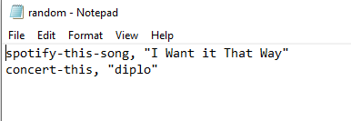

# liri-node-app

## Introduction

Welcome to the LIRI Node application. LIRI is like iPhone's SIRI. However, while SIRI is a Speech Interpretation and Recognition Interface, LIRI is a _Language_ Interpretation and Recognition Interface. LIRI is a command line Node app that takes in parameters and gives you back data. 

## LIRI Functionality

LIRI can search for songs, concerts, and movies by using the Node-Spotify-API, Bandsintown API, and OMDB API. 

Users will access LIRI on the command line using Node in their terminal like this:

`$ node liri.js`

LIRI takes 4 commands:

* `movie-this` - LIRI will search for a movie title.
* `spotify-this-song` - LIRI will search for a song title.
* `concert-this` - LIRI will search for an artist's concert dates.
* `do-what-it-says` - LIRI reads a text file and searches for what the text file tells it to. LIRI can take multiple commands in the text file.

All words in the command must be separated by a hyphen `-`. LIRI will not recognize spaces between words in the command.

Following the command, users can enter the name of a song, movie, or artist they would like search for. The search input does not need to be hyphen separated, spaces are okay. LIRI will then return information about the user's search.

## Examples

### Song Search

### Movie Search

### Concert Search

### Do What It Says

LIRI can read the `random.txt` file and search for the commands in that file. The user does not have to put in a search term, only the command `do-what-it-says`, and LIRI will do what the text file says. The command and the search text in `random.txt` must be separated by a comma `,`. LIRI will not recognize the text if the command search are not separated by a comma. Quotes `"` are optional and LIRI will recognize the search term with or with out them.

## Logs

Everything LIRI outputs is logged to the `log.txt` file. Users can use this file to review errors and previous searches.
